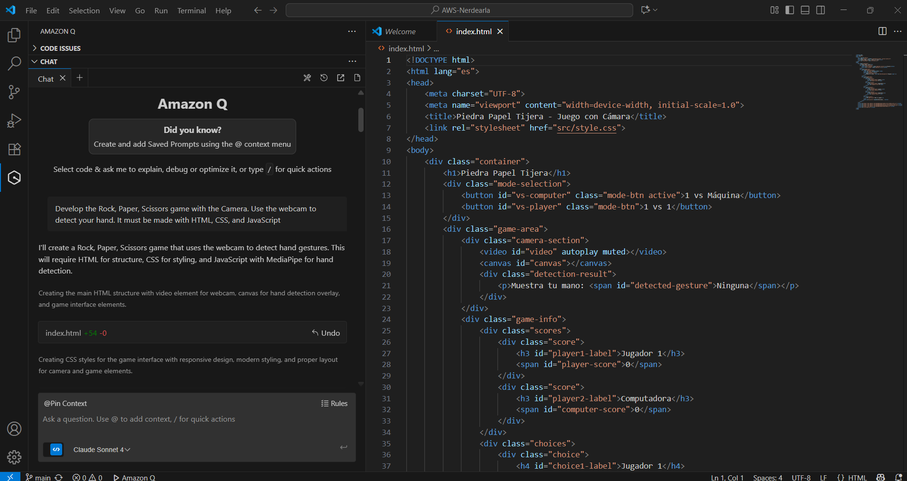
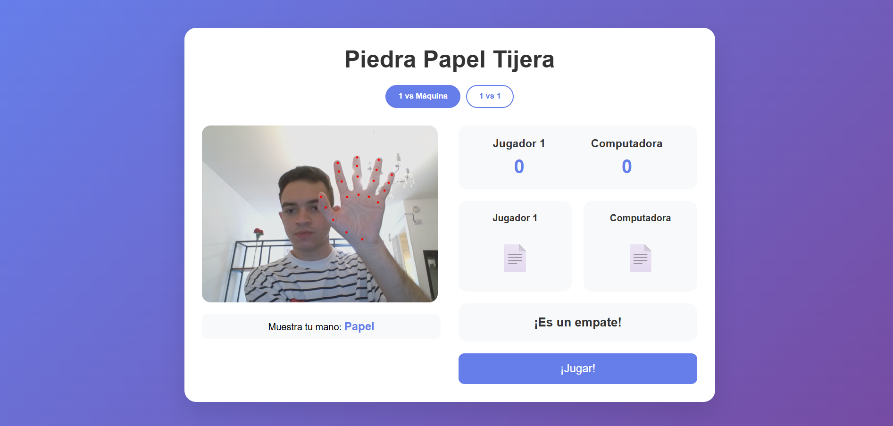

# Piedra Papel Tijera - Juego con Cámara

Un juego interactivo de Piedra, Papel o Tijera que utiliza reconocimiento de gestos por cámara web, desarrollado con MediaPipe y JavaScript vanilla.

## 🎮 Características

- **Reconocimiento de gestos en tiempo real** usando MediaPipe Hands
- **Dos modos de juego**:
  - 1 vs Máquina: Juega contra la computadora
  - 1 vs 1: Modo multijugador local
- **Interfaz completamente en español**
- **Efectos de sonido** generados dinámicamente
- **Diseño responsivo** que funciona en desktop y móvil
- **Detección visual** con landmarks de manos en tiempo real

## 🚀 Demo en Vivo

Simplemente abre `index.html` en tu navegador web moderno.

## 📋 Requisitos

- Navegador web moderno con soporte para:
  - WebRTC (acceso a cámara)
  - Web Audio API (sonidos)
  - ES6+ JavaScript
- Cámara web funcional
- Conexión a internet (para cargar MediaPipe desde CDN)

### Navegadores Compatibles
- Chrome 60+
- Firefox 55+
- Safari 11+
- Edge 79+

## 🛠️ Instalación

1. **Clona el repositorio**:
   ```bash
   git clone https://github.com/tu-usuario/AWS-Nerdearla.git
   cd AWS-Nerdearla
   ```

2. **Abre el juego**:
   - Opción 1: Doble clic en `index.html`
   - Opción 2: Servidor local:
     ```bash
     # Python 3
     python -m http.server 8000
     
     # Node.js
     npx serve .
     ```

3. **Permite acceso a la cámara** cuando el navegador lo solicite

## 🎯 Cómo Jugar

### Modo 1 vs Máquina
1. Selecciona "1 vs Máquina" (modo por defecto)
2. Posiciona tu mano frente a la cámara
3. Haz uno de los gestos:
   - **Piedra**: Puño cerrado
   - **Papel**: Mano abierta (5 dedos extendidos)
   - **Tijera**: Índice y medio extendidos
4. Haz clic en "¡Jugar!" cuando detecte tu gesto
5. La computadora hará su jugada automáticamente

### Modo 1 vs 1
1. Selecciona "1 vs 1"
2. **Jugador 1**: Haz tu gesto y presiona "¡Jugar!"
3. **Jugador 2**: Haz tu gesto y presiona el botón nuevamente
4. Se mostrará el resultado de la ronda

### Reglas del Juego
- **Piedra** vence a **Tijera**
- **Papel** vence a **Piedra**
- **Tijera** vence a **Papel**
- Mismo gesto = **Empate**

## 🏗️ Arquitectura del Proyecto

```
AWS-Nerdearla/
├── index.html              # Página principal
├── src/
│   ├── script.js           # Lógica del juego
│   └── style.css           # Estilos CSS
├── assets/                 # (Reservado para imágenes/sonidos)
├── docs/                   # (Documentación adicional)
├── README.md               # Este archivo
└── LICENSE                 # Licencia del proyecto
```

## 🔧 Tecnologías Utilizadas

### Frontend
- **HTML5**: Estructura semántica
- **CSS3**: Estilos y diseño responsivo
- **JavaScript ES6+**: Lógica del juego

### APIs y Librerías
- **MediaPipe Hands**: Detección de gestos de manos
- **WebRTC**: Acceso a cámara web
- **Web Audio API**: Generación de efectos de sonido
- **Canvas API**: Renderizado de landmarks

### CDN Dependencies
```html
<!-- MediaPipe -->
<script src="https://cdn.jsdelivr.net/npm/@mediapipe/camera_utils/camera_utils.js"></script>
<script src="https://cdn.jsdelivr.net/npm/@mediapipe/control_utils/control_utils.js"></script>
<script src="https://cdn.jsdelivr.net/npm/@mediapipe/drawing_utils/drawing_utils.js"></script>
<script src="https://cdn.jsdelivr.net/npm/@mediapipe/hands/hands.js"></script>
```

## 🎵 Sistema de Sonidos

El juego genera sonidos sintéticos usando Web Audio API:

- **Sonido de jugada**: 440Hz, 0.2s
- **Sonido de victoria**: 523Hz, 0.5s
- **Sonido de derrota**: 220Hz, 0.5s
- **Sonido de empate**: 330Hz, 0.3s

## 🎨 Características de UI/UX

- **Diseño moderno** con gradientes y sombras
- **Feedback visual** en tiempo real
- **Responsive design** para móviles y desktop
- **Accesibilidad** con contrastes apropiados
- **Animaciones suaves** en transiciones

## 🔍 Detección de Gestos

### Algoritmo de Reconocimiento
```javascript
// Lógica simplificada de detección
function detectGesture(landmarks) {
    const extendedFingers = countExtendedFingers(landmarks);
    
    if (extendedFingers === 0) return 'Piedra';
    if (extendedFingers === 2 && isScissorsPattern(landmarks)) return 'Tijera';
    if (extendedFingers === 5) return 'Papel';
    
    return null;
}
```

### Puntos de Referencia
- **21 landmarks** por mano detectada
- **Dedos analizados**: Pulgar, índice, medio, anular, meñique
- **Precisión**: ~85% en condiciones óptimas

## 🐛 Solución de Problemas

### Cámara no funciona
- Verifica permisos del navegador
- Usa HTTPS o localhost
- Revisa que no haya otras apps usando la cámara

### Gestos no se detectan
- Mejora la iluminación
- Mantén la mano dentro del marco
- Asegúrate de hacer gestos claros

### Sin sonido
- Verifica que el navegador permita audio
- Algunos navegadores requieren interacción del usuario primero

## 🚀 Mejoras Futuras

- [ ] Modo torneo con múltiples rondas
- [ ] Estadísticas de juego persistentes
- [ ] Más gestos personalizados
- [ ] Multijugador online
- [ ] Temas visuales alternativos
- [ ] Soporte para múltiples idiomas

## 🤝 Contribuir

1. Fork el proyecto
2. Crea una rama para tu feature (`git checkout -b feature/AmazingFeature`)
3. Commit tus cambios (`git commit -m 'Add some AmazingFeature'`)
4. Push a la rama (`git push origin feature/AmazingFeature`)
5. Abre un Pull Request

## 📄 Licencia

Este proyecto está bajo la Licencia MIT. Ver `LICENSE` para más detalles.

## 👨‍💻 Autor

Desarrollado para AWS Nerdearla - Demostración de Vibe Codiding con Amazon Q

### Chat con Amazon Q


Para este proyecto, utilicé **Amazon Q** para ayudar en el desarrollo del juego interactivo de **Piedra, Papel o Tijera**. Mi solicitud a Amazon Q fue la siguiente:

```HTML
Develop the Rock, Paper, Scissors game with the Camera. Use the webcam to detect your hand. It must be made with HTML, CSS, and JavaScript

```
Desde Visual Studio Code:



## Resultado
El juego detecta los gestos, los compara con la opción de la máquina y muestra el resultado de la partida.


---

⭐ ¡Dale una estrella si te gustó el proyecto!
